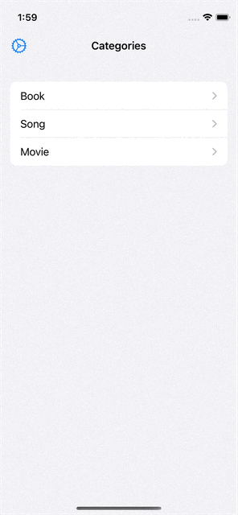
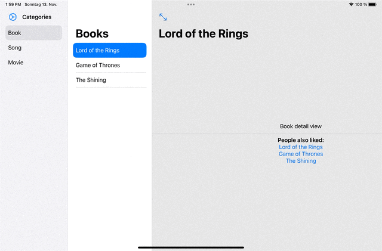
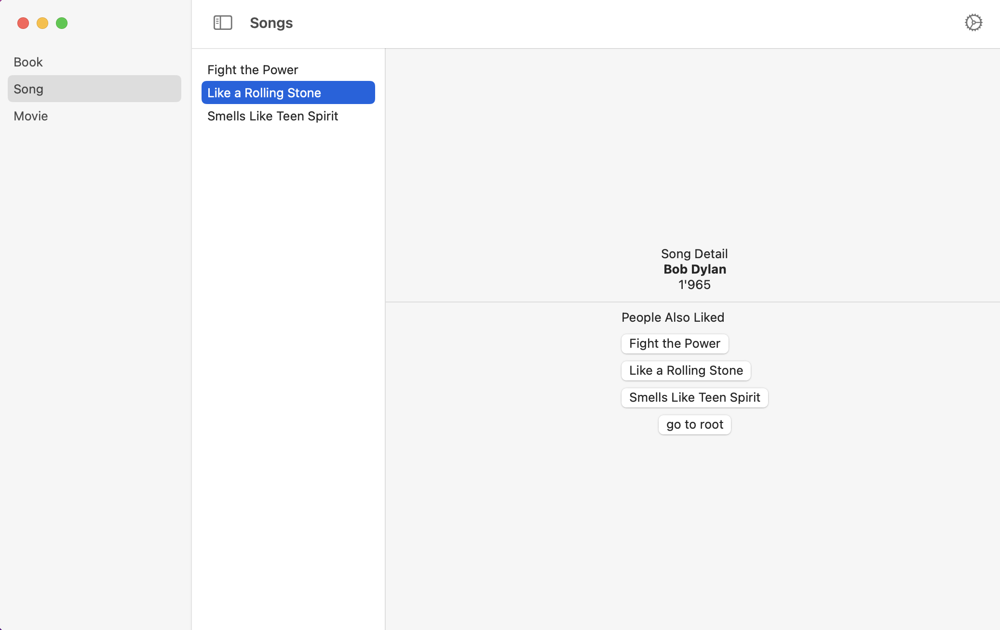
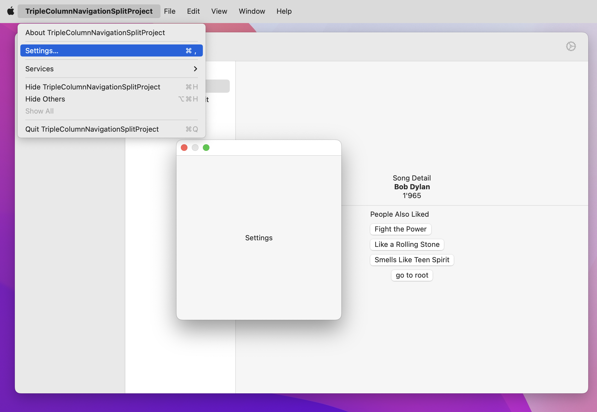

# TripleColumnNavigationSplitProject
Expample Project for NavigationSplitView with 3 columns in SwiftUI for iOS 16 and macOS 13

## iPhone

## iPad

## mac

on macos I used a Settings Windowgroup

